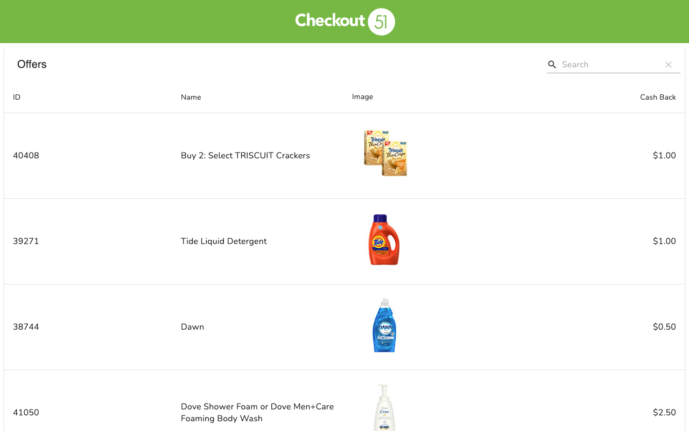

# Checkout 51

[Heroku](https://www.heroku.com/) deployment: https://shrouded-harbor-16023.herokuapp.com/



## Overview

This project is built in [PHP](https://www.php.net/) and [React](https://reactjs.org/) using [Symfony](https://symfony.com/) and [Webpack Encore](https://www.npmjs.com/package/@symfony/webpack-encore), with a [PostgreSQL](https://www.postgresql.org/) database and deployment to [Heroku](https://www.heroku.com/). Styles are written in [SCSS](https://sass-lang.com/documentation/syntax#scss)

The app uses [material-table](https://material-table.com/) to display the data with the following features:

- Sorting rows by column in ascending or descending order (ID, Name, Cash Back)
- Searching and filtering results by text
- Pagination (10, 25, 50, or 100 rows per page)
- Reordering columns by drag-and-drop

Data from [c51.json](c51.json) is populated in the database by the Doctrine fixture: [src/DataFixtures/AppFixtures.php](src/DataFixtures/AppFixtures.php), and fetched by an API call that traces through:

- [src/Controller/OffersApiController.php](src/Controller/OffersApiController.php)
- [src/Service/OffersService.php](src/Service/OffersService.php)
- [src/Repository/BatchRepository.php](src/Repository/BatchRepository.php)

To get the most recent batch of offers and package them in [Models](src/Model/) that serve as data transfer objects (DTO's) to be serialized in the API response.

Note that the Doctrine fixture is also used to populate the Heroku database on deployment during the `release` phase as specified in the [Procfile](Procfile) via the `doctrine:fixtures:load` command.

Tests are written in [PHPUnit](https://phpunit.readthedocs.io/en/9.5/) for the backend and [jest](https://jestjs.io/en/) with [enzyme](https://enzymejs.github.io/enzyme/) for the frontend.

The backend tests are a combination of unit tests for the [Service](tests/Service/OffersServiceTest.php) and [Model](tests/Model/) classes and end-to-end, functional integration tests for the [Controllers](tests/Controller/) and [Repositories](tests/Repository/BatchRepositoryTest.php) that utilize [tests/DataFixtures/BatchAndOfferFixtures.php](tests/DataFixtures/BatchAndOfferFixtures.php) to setup the database for assertions. After the tests are run, any database changes are rolled back by the [doctrine-test-bundle](https://github.com/dmaicher/doctrine-test-bundle) automatically.

The frontend tests are composed of unit tests that use [enzyme](https://enzymejs.github.io/enzyme/) to mount the React components in a virtual DOM and [jest](https://jestjs.io/en/) as the testing framework to run the tests, make assertions, and facilitate mocks.

**Stack:**

- [PostgreSQL](https://www.postgresql.org/)
- [PHP](https://www.php.net/) ([Symfony](https://symfony.com/), [PHPUnit](https://phpunit.readthedocs.io/en/9.5/))
- [React](https://reactjs.org/) ([Webpack Encore](https://www.npmjs.com/package/@symfony/webpack-encore), [jest](https://jestjs.io/en/), [enzyme](https://enzymejs.github.io/enzyme/))
- [SCSS](https://sass-lang.com/documentation/syntax#scss)

## Getting Started

To install dependencies, setup the database, and start the web server all in one command, run [start.sh](start.sh):

```bash
./start.sh
```

**Dependencies:**

- [docker](https://docs.docker.com/get-docker/)
- [brew](https://brew.sh/)
- [yarn](https://classic.yarnpkg.com/en/docs/install/#mac-stable)
- [composer](https://getcomposer.org/download/)
- [symfony](https://symfony.com/download)

To install the frontend packages defined in [package.json](package.json) under `node_modules`, run:

```bash
yarn install
```

To build the frontend [assets](assets) under `public/build`, run:

```bash
yarn encore dev
```

To build the frontend and watch for file changes, run:

```bash
yarn encore dev --watch
```

To install the backend packages defined in [composer.json](composer.json) under `vendor`, run:

```bash
composer install
```

To start up the local database, run:

```bash
docker-compose up
```

To populate the database, run:

```bash
symfony console doctrine:migrations:migrate
symfony console doctrine:fixtures:load
```

To start up the local web server, run:

```bash
symfony serve
```

To view the app, go to: https://localhost:8000/

To shut down the database, run:

```bash
docker-compose down
```

To stop the server, run:

```bash
symfony server:stop
```

To start the database and server in the background, run the commands with the `-d`:

```bash
docker-compose up -d
symfony serve -d
```

## Running Tests

To run all backend tests, run:

```bash
symfony php bin/phpunit
```

To run a specific test, append the file path:

```bash
symfony php bin/phpunit tests/Controller/OffersApiControllerTest.php
```

To run all frontend tests, run:

```bash
yarn jest
```

To run a specific test, append the file path:

```bash
yarn jest assets/components/App.test.js
```
